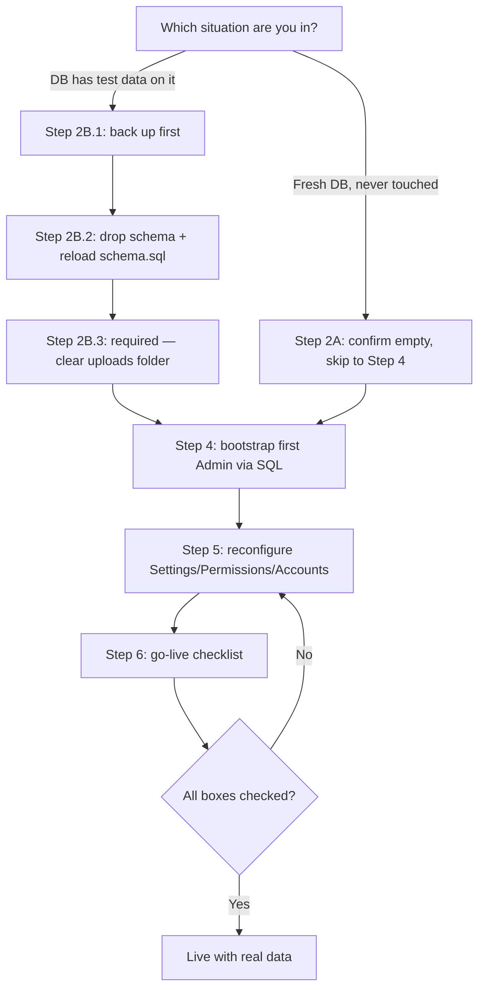

# Clearing Test Data and Going Live — Step by Step

This guide walks you through the switch from "I've been testing this system" to
"real members are using it with real money." It assumes no prior database
experience — every step says exactly what to type.

**The short version:** this system has no seed/demo data baked in anywhere —
`schema.sql` only ever inserts *structural* things (roles, permissions, finance
categories, currencies, your real company name/address). Anything you'd call
"test data" is stuff you created yourself by clicking around the app while
building and testing it — test users, fake accounts, made-up transactions,
loans, and so on, sitting in your live Postgres database. This guide's job is
to help you remove that safely without breaking the structure underneath it.

---

## Step 1 — Decide which of these two situations you're in

**Situation A — "I've only ever tested locally, my Render database has never
been touched" (or barely has).**
If the database Render created for you (`cms-db`) has never had `schema.sql`
run against it, or you ran it once and poked around a little, this is the
easy case — skip to **Step 2A**.

**Situation B — "I've been testing against the real Render database for a
while and it's full of made-up accounts/transactions/loans/members."**
This is the more common case if you've been demoing the app to yourself or
others on the live URL. Go to **Step 2B**.

If you're not sure which one you're in: open the Render dashboard → `cms-db`
→ note it's been running since whenever you first deployed. If you've logged
into the live app and clicked "Record Contribution" or "Record Loan" even
once on that deployment, you're in Situation B.

---

## Step 2A — Fresh database, nothing to clean

Nothing to do here except make sure the schema is actually loaded and you
haven't accidentally left a database half-empty:

1. Connect to your Render database (Render dashboard → **cms-db** → **Connect**
   → copy the **External Connection String**).
2. Run:
   ```
   psql "PASTE_YOUR_CONNECTION_STRING" -c "SELECT COUNT(*) FROM users;"
   ```
3. If that returns `0` (or errors because the table doesn't exist yet), you're
   genuinely clean — jump straight to **Step 4: Bootstrap your first Admin**
   below, skipping Step 3 entirely.
4. If it returns a number greater than 0 and you don't recognize those users,
   you're actually in Situation B — go to Step 2B instead.

---

## Step 2B — Wipe and rebuild (recommended path)

There are two ways to clear test data: **surgically deleting rows** from each
table, or **wiping the whole database and reloading `schema.sql` fresh**. This
guide recommends the second one, and here's why: this app has around 50
interconnected tables (a loan references an account, which references a
currency; a transaction references a category, an account, and the user who
created it; and so on). Deleting rows by hand in the right order without
breaking a foreign-key constraint is genuinely easy to get wrong, even for
experienced developers — and getting it wrong halfway through can leave the
database in a broken, half-deleted state that's worse than what you started
with.

Wiping and reloading is simpler and guaranteed correct, because `schema.sql`
is already the single source of truth for exactly how the database should
look — including your **real** company name and address, which are already
baked into `schema.sql` as the default (not a placeholder), so you won't lose
that.

**What this WILL erase:** every user, account, transaction, loan, investment,
grant, dividend, savings record, side fund entry, requisition, event,
document, notification, and audit log — everything anyone has ever clicked
"Save" on in the app.

**What this WON'T erase (it's rebuilt automatically, unchanged):** the 8
system roles (Admin, Director, Treasurer, etc.), all finance/document/event
categories, currencies, your real company name/address, and the structural
shape of every table.

**What you'll need to redo afterward** (because these live in the database,
not in `schema.sql`): any custom permission grants you made via Settings →
Permissions Management, your uploaded company logo, Side Fund activation, and
the Savings interest rate if you changed it from the default.

**If this deployment is being handed to a genuinely new/different company**
(not just going live with your own data after testing): `schema.sql`'s
seed row currently hardcodes `company_name = 'ZWECK TUKULA Ltd'` and
`company_address = 'WAKISO, UGANDA'` — that's what a fresh reload will show
until someone changes it. You don't need to touch `schema.sql` itself to fix
this: log in as the new Admin after Step 4 and update it through
**Settings → Company**, same as the logo. Nothing about the reset process
below requires editing source files.

### 2B.1 — Back up first, just in case

Even though you're intentionally clearing this data, always take a backup
before a destructive operation — it costs nothing and takes two minutes.

```
pg_dump "PASTE_YOUR_CONNECTION_STRING" > backup-before-reset-$(date +%Y%m%d).sql
```

This saves a full copy of your current database to a file on your computer.
If anything goes wrong, you can restore it with
`psql "CONNECTION_STRING" -f backup-before-reset-DATE.sql` against a fresh
database.

### 2B.2 — Drop everything and reload the schema

```
psql "PASTE_YOUR_CONNECTION_STRING" -c "DROP SCHEMA public CASCADE; CREATE SCHEMA public;"
psql "PASTE_YOUR_CONNECTION_STRING" -f cms/schema.sql
```

The first command deletes every table, then recreates an empty schema to put
new ones in. The second command is the exact same command from the
deployment guide's Step 4 — it rebuilds every table, index, and the
structural seed data (roles, categories, currencies, your company info) from
scratch.

You should see a long stream of `CREATE TABLE`, `CREATE INDEX`, and `INSERT`
messages with no errors. That's a clean, structurally-complete, empty
database.

### 2B.3 — Clear the uploads folder (required for a true blank slate)

Uploaded files (profile photos, generated/uploaded documents, the company
logo) live on disk, not in the database — wiping the database in 2B.2
doesn't delete them, it just makes the old database rows that pointed at
them disappear. The files themselves stay put, orphaned. **If your goal is
"no documents, no files, nothing — exactly as a brand-new company would find
it," this step isn't optional: skipping it means old files are still sitting
there even though nothing in the fresh database references them anymore.**

Everything lives under `cms/uploads/`, in up to three subfolders:
`documents/` (generated receipts, resolutions, minutes, uploaded documents),
`profiles/` (profile photos), and `branding/` (uploaded company logos, only
present if one was ever uploaded).

- **Local:**
  ```
  rm -rf cms/uploads/documents/* cms/uploads/profiles/* cms/uploads/branding/*
  ```
  (Any of those three folders that doesn't exist yet just gets skipped —
  no error.) This empties the folders without deleting the folders
  themselves, so the app has somewhere to write new uploads to.
- **Render:** open the **cms-backend** service → **Shell** tab and run the
  same command from there, against the live disk:
  ```
  rm -rf uploads/documents/* uploads/profiles/* uploads/branding/*
  ```
  Note the Starter plan's disk isn't persistent across deploys anyway (see
  the note at the bottom of `DEPLOYMENT_GUIDE.md`) — so if you've deployed
  since the old files were uploaded, this may already be empty. Still worth
  running once to be certain, since it's harmless either way.

After this, `cms/uploads/` (or the Render disk's `uploads/`) should contain
only empty `documents/`, `profiles/`, and (if it existed) `branding/`
folders — nothing else. Combined with 2B.2's database wipe, that's a
genuinely blank slate: no test data, no leftover files, no stale logo.

---

## Step 3 — (Situation B alternative) Targeted delete instead of a full wipe

Skip this section if you did Step 2B — it's an alternative for the specific
case where you've already spent real time configuring permissions or
branding through the app and don't want to redo that work. It's riskier and
more manual, so only use it if Step 2B's "redo afterward" list feels like too
much.

The safe order to delete in (children before parents, so you never hit a
foreign-key error) is roughly: notifications and audit logs first, then every
module's transactional records (loan repayments before loans, grant tranches
before grants, savings deposits before savings balances, and so on), then
transactions, then references_registry entries, then documents, then
non-Admin users last. Because the exact dependency order depends on exactly
which test data you created and in what order, this isn't a copy-paste
script — if you want to go this route, tell me which specific test records
you want gone (e.g. "delete these 3 test loans and these 2 test users") and
I'll write the exact, safe `DELETE` statements for that specific case rather
than a generic script that risks deleting more than you intended.

---

## Step 4 — Bootstrap your first real Admin user

This system has no default admin account baked in anywhere — the very first
person always has to register normally through the app and then be manually
promoted, because granting a role normally requires already being logged in
as someone who can grant roles (a chicken-and-egg problem every fresh
install of this app hits once). Here's how to break that loop:

1. Open the live app and click **Register**. Create an account with your own
   real name and email — this will become the company's actual Admin.
2. Check your email and click the verification link (this now works
   correctly even before logging in — that bug was fixed as part of this
   session's work).
3. Log into the database directly and promote yourself:
   ```
   psql "PASTE_YOUR_CONNECTION_STRING" -c "
     INSERT INTO user_roles (user_id, role_id, assigned_by)
     SELECT u.id, r.id, u.id
     FROM users u, roles r
     WHERE u.email = 'YOUR_EMAIL_HERE' AND r.name = 'Admin';
   "
   ```
   Replace `YOUR_EMAIL_HERE` with the email you registered with. This grants
   the Admin role to yourself, using yourself as the "assigned by" — a
   one-time exception to the normal flow where an Admin assigns roles to
   other people.
4. Log out and back in (or just refresh) so the app picks up your new role.
   You should now see every menu item, including **Users** and **Settings**.
5. From here on, use **Users → Assign Role** in the app itself for every
   other person — this manual database step is only ever needed once, for
   the very first Admin.

---

## Step 5 — Reconfigure what a fresh database doesn't remember

If you did the full wipe in Step 2B, walk through this checklist once,
logged in as your new Admin:

- **Settings → Company**: confirm the name/address/logo are correct (the
  name and address survive automatically from `schema.sql`; re-upload the
  logo if you had one).
- **Settings → Permissions Management**: grant `FINANCE_FLOOR_LIMIT_UPDATE`
  to Treasurer and Assistant Treasurer (this permission has no default grant
  — see the diagnostic report's note on this) and review any other
  permission grants you'd previously customized.
- **Accounts**: create your real Primary account and, if you use it, a
  Savings account.
- **Side Fund**: if you use this feature, re-activate it and set the real
  monthly amount (Settings → Side Fund, or the Side Fund page itself).
- **Savings settings**: re-set the interest rate/period if you'd changed it
  from the default (0%, annually, simple).
- **Users → Assign Role**: bring your real Directors/Treasurer/Secretary
  etc. on board — have each person register, then assign their role.

---

## Step 6 — Final go-live checklist

Before telling real members to start using the system:

- [ ] Ran the fresh `schema.sql` (or confirmed a genuinely clean database)
- [ ] Cleared `uploads/documents/`, `uploads/profiles/`, and
      `uploads/branding/` (Step 2B.3) — no leftover files from before
- [ ] Bootstrapped and confirmed your Admin login works
- [ ] Company name, address, and logo are correct in Settings
- [ ] `FINANCE_FLOOR_LIMIT_UPDATE` granted to the right roles (see Step 5)
- [ ] Real Primary account created (and Savings account, if used)
- [ ] Real Directors/Treasurer/Secretary users created and roles assigned
- [ ] `GMAIL_USER`/`GMAIL_APP_PASSWORD` set in Render so verification and
      notification emails actually send (see `DEPLOYMENT_GUIDE.md` Step 3)
- [ ] Sent yourself a test contribution/expense and confirmed it shows up
      correctly on the Dashboard and in Transactions
- [ ] Confirmed the email verification and password reset links work
      end-to-end (both were fixed/added as part of this session — worth a
      real test before members rely on them)

Once every box is checked, you're live.

---

## Where this fits



(This renders as a diagram automatically on GitHub, matching the style of
`DEPLOYMENT_GUIDE.md`.)
